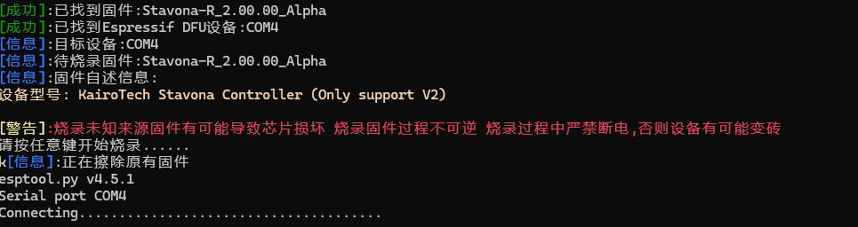

# Q&A
> Troubleshooting any problem without the error log is like driving with your eyes closed.
> 
> 在没有错误日志的情况下诊断任何问题无异于闭眼开车。

**为什么我不能到手即玩？**

由于控制器生产批次的原因，需要手动更新一下固件版本，打开网页Terminal并下载最新的固件安装

固件升级方法：请解压下载的压缩包，按住设备正面的三个按键中最左侧的一个按键插入设备（按住按键插入设备后即可松开按键），然后打开Updater.exe

**在自检界面卡住/游戏卡键该怎么办？**

卡键问题基本是由于过于灵敏导致的，使用V2触摸算法的情况下，调节Terminal内的触摸阈值即可解决